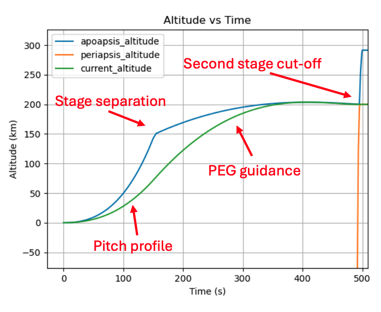
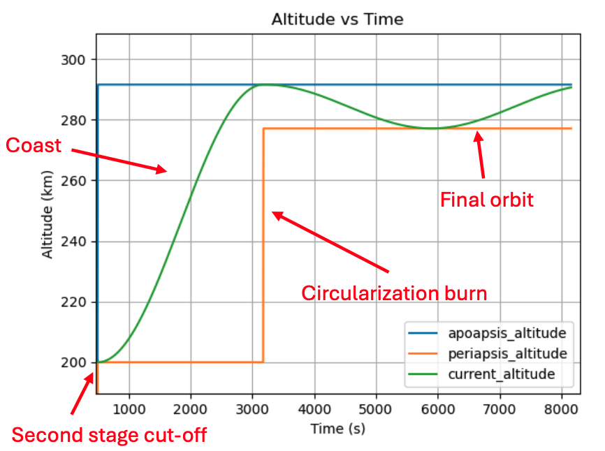
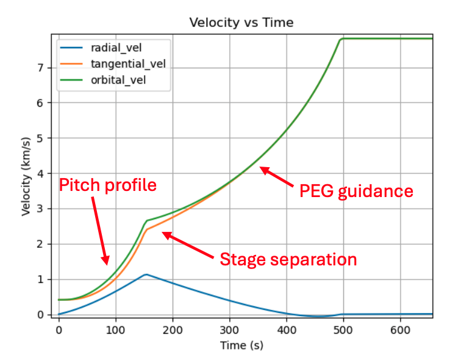
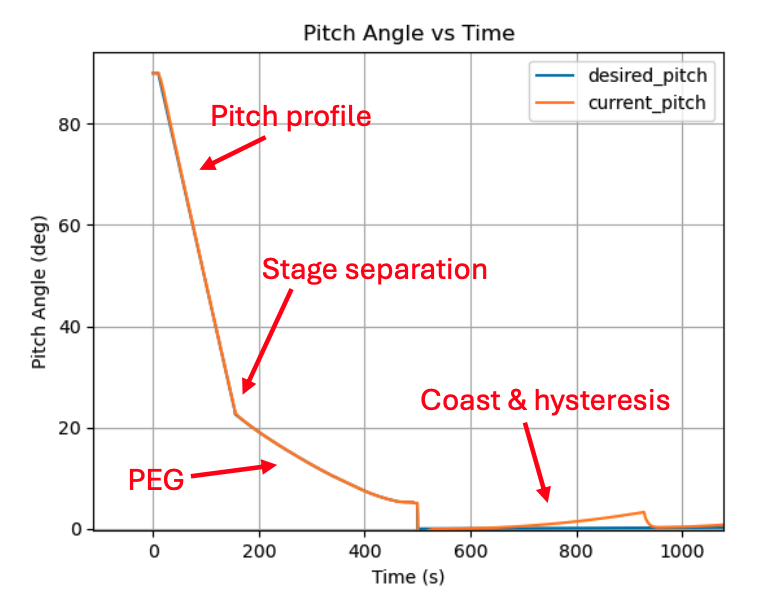
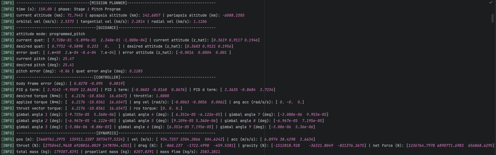

# Rocket Ascent Simulator

*A complete Python-based 6-DoF simulation of a two-stage launch vehicle from liftoff to stable low Earth orbit.*

## Table of Contents

- [Overview](#overview)
- [Key Achievements](#key-achievements)
- [Technical Highlights](#technical-highlights)
- [Results & Visualizations](#results--visualizations)
- [Future Extensions](#future-extensions)

## Overview

This project is a modular, physics-based 6-DoF rocket ascent simulator that models the full flight from vertical liftoff through staging, vacuum guidance, coast, and orbital insertion. The simulation successfully reaches user-defined orbits (e.g. 275 × 290 km) using realistic control and guidance laws.

## Key Achievements

- Implemented full 6-DoF mechanics with rigid-body dynamics, quaternion propagation, multi-engine gimballing, RCS thrusters, and dynamic center of mass  
- Built modular mission planner with clean phase transitions (Initial Ascent → Pitch Program → PEG → Coast → Circularization)  
- Achieved stable orbital insertion with tight apoapsis/periapsis tolerances under gravity, drag, and J2 perturbations  
- Created quality 3D trajectory visualizations segmented by mission phase  
- Maintained clean, object-oriented architecture suitable for extension (Monte Carlo, C++ port, Hardware-in-the-loop, etc.)

## Technical Highlights

- **Dynamics**  
  - Quaternion-based attitude with angular velocity propagation  
  - Multi-engine thrust vector control and least-squares RCS allocation
  - Dynamic center-of-mass & gimbal arm length from propellant depletion 
  - Verlet integration with normalized quaternions  

- **Guidance & Control**  
  - Powered Explicit Guidance (PEG) solving real-time burn direction & throttle  
  - Programmed pitch maneuver for initial gravity turn 
  - PID attitude controller with quaternion error and gain scheduling  

- **Environment**  
  - Newtonian + J2 oblateness gravity  
  - Rotating Earth with coriolis wind in atmosphere  
  - Exponential atmosphere with angle-of-attack dependent drag 

- **Mission Sequencing**  
  - Phase objects (TimeBased, Kick, PEG, Coast, CircBurn, etc.)  
  - Automatic completion checks (time, apoapsis reached, eccentricity condition)  
  - Seamless hand-over between stages  

## Results & Visualizations

### 3D Trajectory by Mission Phase with Earth Reference

### Engine Gimbal Angles During Gravity Turn

> Note: The gimbal angles above are highly exaggerated for effect. 

### Altitude Profile (Launch through Second Stage Cut-off)

### Altitude Profile (Coast through Orbit)

### Velocity Profile

### Pitch Angle Evolution

### Example Logs

## Future Extensions

- Monte Carlo framework for dispersion analysis  
- Boost-back, re-entry, and landing burns with added control surfaces
- C++/Rust performance port of dynamics & integration core  
- Hardware-in-the-loop (HIL) interface layer  
- Real-time visualization dashboard